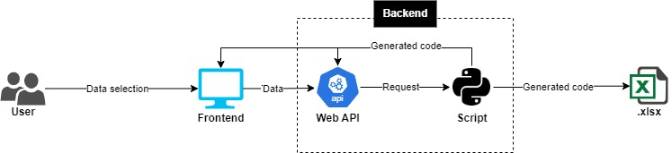

# Code Generator Web App (PoC)

This is a Proof of Concept (PoC) for a code generator that deploys a web application and stores the generated codes in an Excel file. The application is built using **FastAPI** and packaged into an executable (`code_generator.exe`) using **PyInstaller**.

<p align="center">
  
</p>

## Table of Contents

- [Requirements](#requirements)
- [Installation](#installation)
- [Usage](#usage)
- [Generating the Executable](#generating-the-executable)
- [Project Structure](#project-structure)
- [Contributing](#contributing)
- [License](#license)

## Requirements

Before you begin, ensure you have the following requirements installed on your system:

- **Python 3.7+**
- **Conda** for managing virtual environments.
- **Git** for cloning the repository.

## Installation

1. **Clone the Repository:**

   ```bash
   git clone https://github.com/your_username/code-generator-web-app-poc.git
   cd code-generator-web-app-poc
   ```

2. **Create a Virtual Environment with Conda:**

   Create a virtual environment named `virtualenv` (or any name you prefer):

   ```bash
   conda create --name virtualenv python=3.11
   ```

   Activate the virtual environment:

   ```bash
   conda activate virtualenv
   ```

3. **Install the Dependencies:**

   Install the dependencies listed in `requirements.txt`:

   ```bash
   pip install -r requirements.txt
   ```

## Usage

1. **Run the Web Application:**

   You can run the application directly from the source code (if you prefer not to use the executable):

   ```bash
   python src/main.py
   ```

   This will start a local FastAPI server. Open your web browser and navigate to `http://127.0.0.1:8000` to use the web application.

2. **Using the Executable:**

   If you prefer to use the precompiled executable (`code_generator.exe`), simply navigate to the `dist` folder:

   ```bash
   cd dist
   ```

   Then run the executable:

   ```bash
   ./code_generator.exe
   ```

   This will automatically open your web browser to `http://127.0.0.1:8000`, where you can start generating codes.

## Generating the Executable

The executable (`code_generator.exe`) was generated using **PyInstaller**. Below are the steps followed to create the executable:

1. **Install PyInstaller:**

   Make sure PyInstaller is updated in your virtual environment:

   ```bash
   pip install --upgrade pyinstaller
   ```

2. **Generate the Executable:**

   To create the executable, the `main.spec` file was used:

   ```bash
   pyinstaller main.spec
   ```

   This will generate the executable in the `dist` folder.

## Project Structure

The project has the following structure:

```
code-generator-web-app-poc/
│
├── build/
├── dist/
│   └── code_generator.exe
├── src/
│   ├── __pycache__/
│   ├── static/
│   ├── templates/
│   ├── __init__.py
│   ├── main.py
│   ├── models.py
│   └── views.py
├── .gitignore
├── LICENSE
├── main.spec
├── README.md
└── requirements.txt
```

- **src/**: Contains all the source code of the application.
  - **static/**: Static files such as CSS or images.
  - **templates/**: HTML templates for the web interface.
  - **main.py**: The main entry point of the application.
  - **models.py**: Contains the logic for generating and storing codes.
  - **views.py**: Handles the web interface rendering.
- **main.spec**: PyInstaller configuration file for generating the executable.
- **requirements.txt**: Project dependencies.

## Contact

Contact me: contacto@dialektico.com

Website: https://dialektico.com/

## License

This project is licensed under the Apache 2.0 License. For more details, see the [LICENSE](LICENSE) file.
